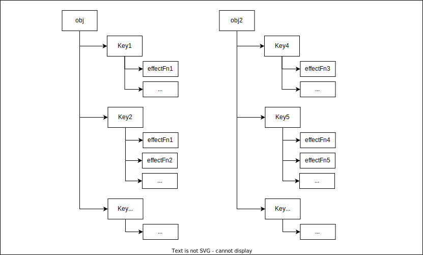

> 看到這章時，我開始覺得難度直線上升，程式碼量也多出了不少，且複雜相當多，
是需要同步手寫慢慢釐清原理，建議先了解完Set, WeakMap, Map數據結構並保持清醒，思緒清晰時再進行閱讀。
而本章內容相對前三章多了非常多(前三章頁數約12頁上下，本章42頁。)
</br>


# 嚮應系統的作用與實現

|[1. 響應式數據與副作用函數](#響應式數據與副作用函數)|[2. 響應式數據的基本實現](#響應式數據的基本實現)|[3. 設計一個完善的響應系統](#設計一個完善的響應系統)|
|-|-|-|
</br>

Vue3的響應式系統改採以Proxy對數據進行代理，除了性能方面的提升外，原文也提到這與「語言規範層面的知識」有一些關係。

> 如何根据语言规范实现对数据对象的代理，以及其中的一些重要细节。(原文所述)

本篇帶著我們初步的實現響應式系統，並不斷遇到需要解決的問題，並去修繕它，進而完成一個「相對完善的響應式系統」。
</br>

---
## 響應式數據與副作用函數
---
「副作用函數」指得是一個會直接或間接影響其他函數執行，或一些對全局變量進行修改的函數。

「響應式數據」則是當數據發生變化時，可以觸發某個函數的數據。
例如這樣。

```js
const obj = { text: 'Hello World'} // 數據

function effect() { // 副作用函數
  document.innerText = obj.text
}

obj.text = 'New Hello World' // 當這句執行完畢時，希望自動去調用effect函數去改變DOM元素的文本節點
```
但目前是做不到的，當obj.text被修改時，它並沒有執行effect函數
</br>

---
## 響應式數據的基本實現
---
接下來我們去思考，當obj.text執行完畢後，如何去觸發一個effect函數?
> 排除掉Vue2的做法，這裡我的第一個念頭是addEventListener，但我嘗試後對addEventListener是EventTarget的方法這個概念有更深入的了解，並非一般的js物件擁有的方法。

這裡先找到了三個線索
* 當副作用函數(effect)執行時，會發生對目標的「讀取」操作
* 當obj.text被修改時，會發生對目標(obj.text)的「設置」操作
* obj.text被修改時，需要去觸發被依賴的副作用函數。

**讀取**


</br>

**設置**


</br>
</br>

為了完成對目標的讀取及設置的攔截，Vue3使用Proxy的方式去進行代理。
```js
const data = { text: 'Hello World' }  // 數據
const bucket = new Set()  // 用以存放副作用函數的集合

const obj = new Proxy(data, { // 代理原始數據
  // 攔截讀取
  get(target, key) {
    bucket.add(effect) // 將副作用函數添加進集合中
    return target[key]
  },

  // 攔截設置
  set(target, key, newValue) {
    target[key] = newValue // 將原始數據修改為新值
    bucket.forEach(fn => fn()) // 執行該集合中的所有函數
    return true
  }
})
```

到這，我們完成了將一個數據轉化為響應式數據的簡陋過程。
</br>

---
## 設計一個完善的響應系統
---
先處理第一個問題，當函數effect不叫做effect，而是叫做myEffect、甚至是個匿名函數時我們該怎麼辦？於是我們需要使用一個全局變量來儲存這個副作用函數。
```js
let activeEffect // 創建一個全局變量，用來存放將要被註冊副作用函數

function effect(fn) {
  activeEffect = fn // 將副作用函數存入全局變量
  fn() // 執行副作用函數
}
```

當有副作用函數要被註冊時，我們就可以把副作用函數傳入effect函數來調用
```js
effect(() => { // 將副作用函數傳入
  document.body.innerHTML = obj.text
})
```

這時我們的響應式系統就應該要改為這樣
```js
const obj = new Proxy(data, { // 代理原始數據
  // 攔截讀取
  get(target, key) {
    if(activeEffect) { // 如果activeEffect有值
      bucket.add(activeEffect) // 則添加入集合
    }
    return target[key]
  },

  // 攔截設置
  set(target, key, newValue) {
    target[key] = newValue // 將原始數據修改為新值
    bucket.forEach(fn => fn()) // 執行該集合中的所有函數
    return true
  }
})
```
</br>
目前整個響應式系統的流程將為這樣


> 設置操作中終將再觸發一次讀取的問題暫且先擱置一旁

</br>

但現在存在一個問題，假如我們去設置一個不存在的屬性，仍然會導致副作用函數被調用，也就是重新觸發了Proxy的set()，這意味著物件的所有屬性和副作用函數相依賴。

```js
obj.notExist = '一個原始數據不存在的屬性'
```

其中的原因是因為bucket是一種Set數據結構，他沒辦法將代理物件的屬性和副作用函數個別進行依賴，為了解決這個問題，我們需要重新設計bucket的設計，其目的是「將屬性和副作用函數進行個別的依賴」，如圖所示。



可以看到，每個物件屬性可以擁有多個依賴的副作用函數，而副作用函數可能同時被多個屬性依賴，所以我們將bucket由Set結構改為WeakMap結構，並且修改Proxy的Handle來達到這個目的。

```js
const bucket = new Map()

const obj = new Proxy(data, { // 代理原始數據
  // 攔截讀取
  get(target, key) {
    if(!activeEffect) return

    let depsMap = bucket.get(target) //從bucket取得原始數據

    if(!depsMap) { // 如果depsMap沒有值的話
      // 則在bucket(WeakMap)中去設立一個Key為原始數據，Value為一個空Map
      bucket.set(target, (depsMap = new Map))
    }

    let deps = depsMap.get(key) // 透過讀取的Key取得依賴的副作用函數

    if(!deps) { // 如果deps沒有值的話
      // 則以原始數據的Key為Map的Key，Value為一個空集合
      depsMap.set(key, (deps = new Set()))
    }

    deps.add(activeEffect) // 最後將副作用函數添加入集合中
    return target[key]
  },

  // 攔截設置
  set(target, key, newValue) {
    target[key] = newValue // 將原始數據修改為新值
    const depsMap = bucket.get(target) // 藉由target從bucket中取得被依賴的key(Map)
    if(!depsMap) return
    const effects = despMap.get(key) // 再藉由Key找出所有被依賴的副作用函數(Set)
    effects && effects.forEach(fn => fn()) // 有值的執行所有副作用函數
    return true
  }
})
```
</br>
這段看著比較複雜，比較具象的引用圖就像這樣。


(20220404未完)